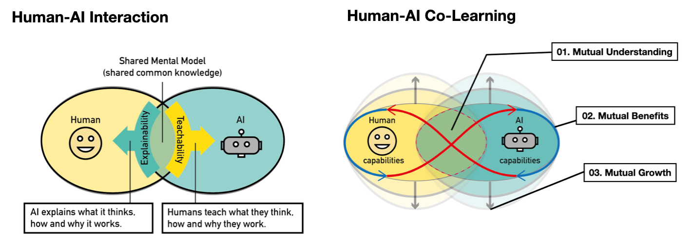
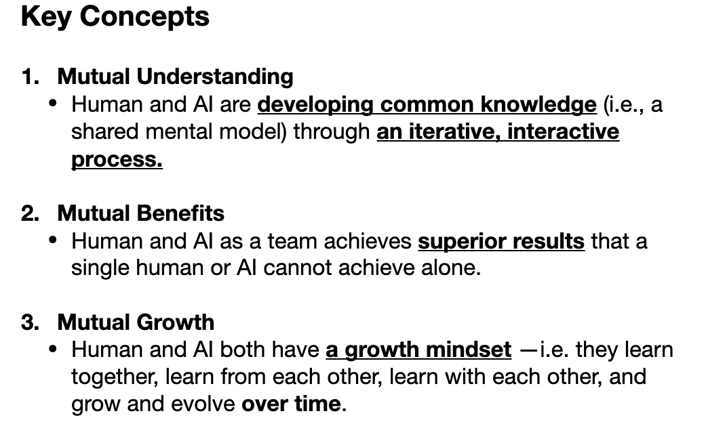
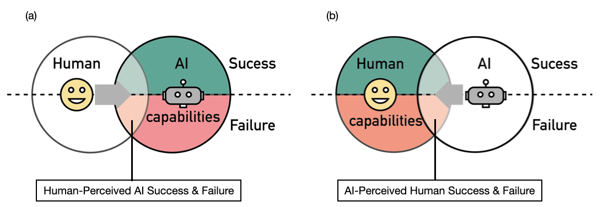

Big theme: Human-AI Co-Learning (Huang et al., 2019) https://arxiv.org/abs/1910.12544

## Human-AI Interaction vs Human-AI Co-Learning

### AI sucess vs AI failure

----------------------------
# Human-AI Collaboration
Literature for Human-AI collaboration, Hybrid Intelligence, Human-AI interaction

## Human-Centered Artificial Intelligence
- [Human-Centered Artificial Intelligence: Reliable, Safe & Trustworthy. (Shneiderman 2020)](https://www.tandfonline.com/doi/full/10.1080/10447318.2020.1741118)
- [Human-Centered Artificial Intelligence: Three Fresh Ideas. (Shneiderman, 2020)](https://aisel.aisnet.org/cgi/viewcontent.cgi?article=1136&context=thci)
- [Workshop: Human-Centered AI: Reliable, Safe & Trustworthy, University of Maryland, 2020.](https://hcil.umd.edu/human-centered-ai-trusted-reliable-safe/)
- [- Bridging the Gap Between Ethics and Practice: Guidelines for Reliable, Safe, and Trustworthy Human-centered AI Systems](https://dl.acm.org/doi/10.1145/3419764)

## Interactive Machine Learning
- Power to the People: The Role of Humans in Interactive Machine Learning (AI Magine 2014)

## Hybrid Intelligence
- [Directions in Hybrid Intelligence: Complementing AI Systems with Human Intelligence (Karmar, IJCAI 2016)](https://www.ijcai.org/Proceedings/16/Papers/603.pdf)
- [Hybrid Intelligence (Dominik et al., 2019)](https://link.springer.com/article/10.1007/s12599-019-00595-2)
- [The Future of Human-AI Collaboration: A Taxonomy of Design Knowledge for Hybrid Intelligence Systems (Dominik et al., 2019)](https://www.alexandria.unisg.ch/254994/)
- [On Facilitating Human-Computer Interaction via Hybrid Intelligence Systems (Lasecki, 2019)](https://pdfs.semanticscholar.org/af1f/3e78f052e0f50840b284c94ff5ae2c3a1c8f.pdf)

## Collective Intelligence / Crowdsourcing
- [Human-Computer Interaction and Collective Intelligence (Bigham et al., 2014)](https://pdfs.semanticscholar.org/348e/72a77ff388b5af54f7bf84c032317b4d083e.pdf)
- Making Better Use of the Crowd: How Crowdsourcing Can Advance Machine Learning Research (2018)

## Machine Teaching
- Machine Teaching A New Paradigm for Building Machine Learning Systems (2017)
- The Importance of UX for Machine Teaching (SSS18)
- [Interactive Teaching Strategies for Agent Training (IJCAI 2016)](https://www.microsoft.com/en-us/research/publication/interactive-teaching-strategies-agent-training/)

## Agency vs Automation
- Man-Computer Symbiosis (Licklider, 1960)
- Direct Manipulation vs. Interface Agents (1997)
- Principles of Mixed-Initiative User Interfaces (Horvitz, 1999)
- Agency plus automation: Designing artificial intelligence into interactive systems (Heer, 2019)

## Human-AI Interaction
- [Guidelines for Human-AI Interaction (Amershi et al., CHI2019)](https://www.microsoft.com/en-us/research/uploads/prod/2019/01/Guidelines-for-Human-AI-Interaction-camera-ready.pdf)
- [Ask not what AI can do, but what AI should do: Towards a framework of task delegability (Lubars an Tan, 2019)](https://arxiv.org/abs/1902.03245)

## AI/ML as UX
- UX Design Innovation: Challenges for Working with Machine Learning as a Design Material (CHI 2017)
- Reimagining the Goals and Methods of UX for ML/AI
- The Role of Design in Creating Machine-Learning-Enhanced User Experience
- Investigating How Experienced UX Designers Effectively Work with Machine Learning (DIS 2018)
- Mapping Machine Learning Advances from HCI Research to Reveal Starting Places for Design Research (CHI 2018)
- [Re-examining Whether, Why, and How Human-AI Interaction Is Uniquely Difficult to Design (Yang et al., CHI 2020)](https://www.researchgate.net/publication/338459008_Re-examining_Whether_Why_and_How_Human-AI_Interaction_Is_Uniquely_Difficult_to_Design)
- 

## Intelligibility, Explainability, Explainable AI
- How Good is 85%? A Survey Tool to Connect Classifier Evaluation to Acceptability of Accuracy (CHI 2015)
- "Why Should I Trust You?": Explaining the Predictions of Any Classifier (KDD 2016)
- Towards A Rigorous Science of Interpretable Machine Learning (2017)
- Trends and Trajectories for Explainable, Accountable and Intelligible Systems: An HCI Research Agenda (CHI 2018)
- Designing Theory-Driven User-Centric Explainable AI (CHI 2019)
- Explaining Decision-Making Algorithms through UI (CHI 2019)
- [The Challenge of Crafting Intelligible Intelligence (Weld and Bansal, CACM 2019)](https://cacm.acm.org/magazines/2019/6/237004-the-challenge-of-crafting-intelligible-intelligence/fulltext#R13)
- [Interpreting Interpretability: Understanding Data Scientists’ Use of Interpretability Tools for Machine Learning (Kaur et al., CHI 2020)](http://www-personal.umich.edu/~harmank/Papers/CHI2020_Interpretability.pdf)
- [Questioning the AI: Informing Design Practices for Explainable AI User Experiences (Liao et al., CHI 2020)](https://arxiv.org/abs/2001.02478)
- [No Explainability without Accountability: An Empirical Study of Explanations and Feedback in Interactive ML (Smith-Renner et al., CHI 2020)](https://homes.cs.washington.edu/~weld/papers/smith-renner-chi20.pdf)

## FATE: Fairness, Accountability, Transparency, and Ethics in AI
- [Co-Designing Checklists to Understand Organizational Challenges and Opportunities around Fairness in AI (Madaio et al., CHI 2020)](http://www.jennwv.com/papers/checklists.pdf)
- [Principles for Accountable Algorithms and a Social Impact Statement for Algorithms](https://www.fatml.org/resources/principles-for-accountable-algorithms)
- [Model Cards for Model Reporting]()

## Human-AI Team
- Updates in Human-AI Teams: Understanding and Addressing the Performance/Compatibility Tradeoff (AAAI 2019)
- Beyond Accuracy: The Role of Mental Models in Human-AI Team Performance (HCOMP 2019)

## Human-in-the-loop ML
- https://livebook.manning.com/book/human-in-the-loop-machine-learning/ (in-progress book, [Robert Munro](http://www.robertmunro.com))

## Applications for Human-AI Co-Learning
### Writing
- [Metaphoria: An Algorithmic Companion for Metaphor Creation (CHI 2019)](http://www.katygero.com/papers/Metaphoria_Revision.pdf)
- [Creative writing with a machine in the loop: Case studies on slogans and stories](IUI 2018)
- [LISA: lexically intelligent story assistant (AIIDE 2017)](https://www.aaai.org/ocs/index.php/AIIDE/AIIDE17/paper/viewPDFInterstitial/15883/15202)

### Creativity (Drawing, Music, etc)
- [In a Silent Way: Communication Between AI and Improvising Musicians Beyond Sound (CHI 2019)](https://dl.acm.org/citation.cfm?id=3300268)
- [I lead, you help but only with enough details: Understanding user experience of co-creation with artificial intelligence (CHI 2018)](https://dl.acm.org/citation.cfm?id=3174223)

### Design
- [VisiBlends: An Interactive Pipeline for Creating Visual Blends (CHI 2019)](https://www.cs.columbia.edu/~chilton/web/my_publications/VisiBlends_CHI2019.pdf)
- [Human Errors in Interpreting Visual Metaphor (C&C 2019)](https://www.cs.columbia.edu/~chilton/web/my_publications/Human_Errors_in_Interpreting_Visual_Meaning.pdf)

### Conversational Agents
- [What Makes a Good Conversation? Challenges in Designing Truly Conversational Agents (CHI 2019)](https://arxiv.org/pdf/1901.06525.pdf)
- [Caring for Vincent: A Chatbot for Self-compassion(CHI 2019)](https://minha-lee.github.io/files/lee_vincent_chatbot_CHI2019.pdf)

### Others
- [Calendar.help: Designing a workflow-based scheduling agent with humans in the loop](https://arxiv.org/pdf/1703.08428)
- [AI-Mediated Communication: How the Perception that Profile Text was Written by AI Affects
Trustworthiness (CHI 2019)](http://www.mauricejakesch.com/pub/chi2019__ai_mc_camera_ready.pdf)

-------

## Courses
- [Human-AI Interaction, by Chinmay Kulkarni an Mary Beth Kery, CMU (formo class by Jeff Bigham and Joseph Seering, Fall 2018)](http://www.humanaiclass.org)
- [CS 889: Human-AI Interaction by Edith Law, U.Waterloo](http://edithlaw.ca/teaching/cs889/2018/index.html)
- [CS 294: Fairness in Machine Learning by ,UC Bekeley](https://fairmlclass.github.io)
- [CS598RK: HCI for Machine Learning, by Ranjitha Kumar and Jinda Han,UIUC](https://courses.grainger.illinois.edu/cs598rk/fa2019/)
- [Human-centered Machine Learning (2018 Spring), by Chenhao Tan, University of Colorado Boulder](https://chenhaot.com/courses/hcml/home.html)
- [CS6724: Advanced Topics in Human-Computer Interaction: Human-AI Interaction, by Kurt Lurther, Virginia Tech](https://wordpress.cs.vt.edu/cs6724s20/)
- [Designing AI to Cultivate Human Well-Being, by Jennifer Aaker and Fei-Fei Li, Stanford](https://designing-ai.su.domains)
- [CS279R: Research Topics in HCI: Human-AI Interaction](https://docs.google.com/document/d/1tR7G1ghLYpcqFj3v_E3CEBTAINIJuMTOumR1CCfykoo/edit)
- [CS492F: Human-AI Interaction, by Jean Young Song and Juho Kim, KAIST](https://www.kixlab.org/courses/cs492-fall-2020/index.html)
- [CS279R Research Topics in HCI: Human-AI Interaction, by Elena L. Glassman, Harvard](https://docs.google.com/document/d/1tR7G1ghLYpcqFj3v_E3CEBTAINIJuMTOumR1CCfykoo/edit?usp=sharing)

## Labs
- [Polo Club of Data Science @ Georgia Tech](https://poloclub.github.io)

## Workshops & Tutorials
- [PAIR 2019 @Google](https://pair.withgoogle.com/events/symposium/)
- [HAI 2019 @Stanford](https://hai.stanford.edu/events/2019-hai-symposium/overview)
- [Machine Teaching Group @MSR](https://www.microsoft.com/en-us/research/group/machine-teaching-group/)
- [HAI-GEN 2020 @ IUI 2020 Workshop on Human-AI Co-Creation with Generative Models](https://hai-gen2020.github.io)
- [AAAI 2020 Tutorial – Guidelines for Human-AI Interaction](https://www.microsoft.com/en-us/research/project/guidelines-for-human-ai-interaction/articles/aaai-2020-tutorial-guidelines-for-human-ai-interaction/)
- [Participatory Approaches to Machine Learning, ICML 2020 Workshop (July 17, 2020)](https://participatoryml.github.io)

## Others Links
- https://pair.withgoogle.com
- [AI Guidelines in the Creative Process](https://medium.com/microsoft-design/ai-guidelines-in-the-creative-process-807b6d31cda2)
- https://hcil.umd.edu/human-centered-ai-a-second-copernican-revolution/
- https://hcil.umd.edu/human-centered-ai-trusted-reliable-safe/
- https://machinelearning.design

## Other Awesome HAI list
- https://github.com/bwang514/awesome-HAI/blob/master/README.md

-------
For artist
- https://ml4a.github.io/classes/itp-F18/
